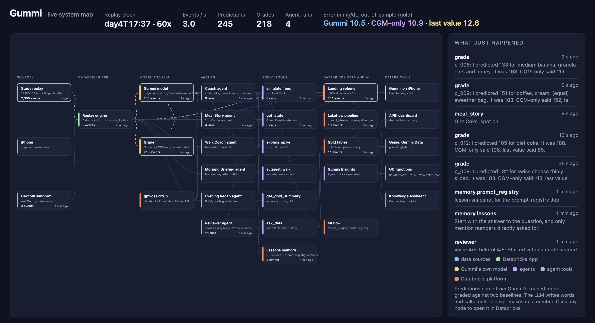

<div align="center">


# Gummi

A glucose coach that predicts, acts, and checks its own work.

Overall winner, WolfHacks 2026 · [Devpost](https://devpost.com/software/gummi-nrwoqt)


</div>

## Hi, I'm Gummi

I'm a little jelly koala who lives on your phone and helps you keep your glucose in a good place.

If you have prediabetes and wear a glucose monitor, you can see where your glucose has been. What you usually want to know is where it's going. Can I have this cookie? Should I take a walk first? Why did lunch hit me so hard? On top of that, apps get Dexcom readings about an hour late, so there's a gap right where it matters most.

So I fill in that hour with my own model and look about two hours ahead. Ask me about a snack and I'll show you what it would probably do before you eat it. If I see a spike coming, I'll suggest a short walk. After a meal I'll tell you how it went, and at night I'll recap your day.

And I keep myself honest. Two hours after every prediction, I check it against what really happened and show you how I did next to two simpler methods. Some days a breakfast outsmarts me, and you'll see that too.

I'm here for adults with prediabetes or type 2 diabetes who don't take insulin. I'm a coach, so please don't use me for treatment decisions. Your Dexcom app has your real readings.

## How it all works

None of my team wears a Dexcom, so I learned from 15 real people in the [BIG IDEAs study](https://physionet.org/content/big-ideas-glycemic-wearable/1.1.3/). Their days stream through me as a live replay, with the same one-hour delay a real Dexcom has. You pick someone to follow and go through their day with them. Steps come from your actual phone, and a real Dexcom account connects through Dexcom's sandbox.

Here's everything behind me, live:



<sub>Each box is a real part of the system and lights up when it does something. On the left are the inputs. In the middle are my model, the grader and my agents. On the right is Databricks, where everything ends up.</sub>

## Running on Databricks

My whole backend runs on Databricks. Here's what each piece does:

| Piece | What it does |
|---|---|
| **Databricks Apps** | Hosts the backend (FastAPI). The replay, my model, my agents and the live connection to your phone all run here. |
| **Lakeflow Declarative Pipelines** | Every reading, meal, prediction and grade gets written to a volume. The `gummi_stream` pipeline picks each one up about 6 seconds later and turns it into bronze, silver and gold Delta tables. |
| **Unity Catalog** | Keeps the tables, volumes, my registered model, a couple of SQL functions and even my prompt in one governed place. |
| **Foundation Model APIs** | I chat on gpt-oss-20b because it's quick, with gpt-oss-120b and Qwen3 as backups. Llama 4 Maverick reviews my answers, so a different model family keeps an eye on me. |
| **MLflow** | Records every conversation step by step, which tools I used and what they returned, plus the reviewer's scores. |
| **Prompt Registry and Jobs** | When the reviewer spots something I could do better, it writes a lesson. A Job turns those lessons into a new version of my prompt. |
| **Agent Bricks** | Gummi Insights is a supervisor agent for the deeper questions. It decides whether to ask a Genie space or a Unity Catalog function over the gold tables. |
| **AI/BI and Genie** | A live dashboard of how accurate I am, and a place to ask the data questions in plain English. |

Some numbers from the live system: screens on the phone load in 25 to 250 ms, my first words in chat show up in about 1.5 to 2 seconds, my model makes a prediction in under 50 ms, and events reach the bronze table 4 to 8 seconds after they land.

## How accurate I am

This is my average error in mg/dL, so lower is better. Everyone in these numbers was predicted by a version of me that never saw their data during training.

| Looking ahead | Me | CGM-only (published method) | Last reading |
|---|:-:|:-:|:-:|
| 30 min | **8.9** | 9.5 | 10.7 |
| 1 hour | **12.1** | 13.4 | 14.9 |
| 2 hours | **14.2** | 15.7 | 18.4 |
| 1 hour after a meal | **15.7** | 17.3 | 20.4 |

My team first rebuilt the published CGM-only model (13.90 RMSE at 30 minutes) and then taught me about meals. Food is what moves glucose the most, so knowing what you ate helps a lot.

## What's in here

```
gummi/
├── ios/        the iPhone app, my 3D jelly body, live updates and chat
├── backend/    the Databricks App: replay, grading, agents, food log, system map, fleet view
├── data/       data loading, my model, the Lakeflow pipeline, gold tables, Genie, dashboard
└── docs/       the API contract and the design decisions
```

## Running me yourself

<details>
<summary><b>Data and pipeline</b></summary>

```bash
cd data
python scripts/download_bigideas.py          # the BIG IDEAs files we use, checksum-verified
databricks bundle deploy                     # jobs, the gummi_stream pipeline, tables
databricks bundle run gummi_data_load_train  # load, evaluate, train, save the model to a UC volume
```
Then start `gummi_stream` (continuous for demos, triggered the rest of the time).
</details>

<details>
<summary><b>Backend (Databricks App)</b></summary>

```bash
cd backend
python3 -m venv .venv && .venv/bin/pip install -r requirements.txt
scripts/deploy.sh                       # syncs and deploys the App (CLI profile "gummi")
.venv/bin/python scripts/smoke.py       # hits every route through the Apps proxy
```
For local tests, run `scripts/fetch_cache.py` once and then `pytest tests/`.
</details>

<details>
<summary><b>iOS</b></summary>

```bash
cd ios
xcodegen generate && open Gummi.xcodeproj
```
Put the App URL and credentials in `Config/Secrets.xcconfig.local` (it's git-ignored). Without them I'll run on built-in demo data.
</details>

<details>
<summary><b>Demo</b></summary>

```bash
backend/.venv/bin/python backend/scripts/demo_stage.py stage   # sets up the evening of Participant 12's day
backend/.venv/bin/python backend/scripts/demo_stage.py go      # a meal gets graded about 10 seconds later
```
</details>

## The people who made me

| | |
|---|---|
| **Pranav Somalraju** | Backend and Databricks platform: the Databricks App, replay and grading, all six agents, MLflow tracing and reviews, the prompt registry and Jobs, the Agent Bricks supervisor, the Dexcom connection and deployment |
| **Nikhil Ambavaram** | Data and model: loading BIG IDEAs, training and evaluating my model, the Lakeflow pipeline and gold tables, the Genie space and dashboard |
| **Mahil Manoharan** | iOS: the app, my 3D koala body, live updates and chat |

## Thanks

Data comes from the BIG IDEAs Lab Glycemic Variability and Wearable Device Data v1.1.3 on PhysioNet (Bent et al. 2021, npj Digital Medicine). The walking effect comes from Buffey et al. 2022 in Sports Medicine. Dexcom connection through the Dexcom API sandbox.
