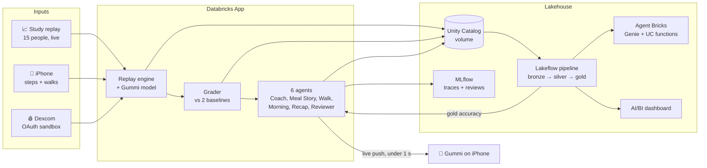

<div align="center">


# Gummi

**A glucose coach that predicts, acts, and checks its own work.**

🏆 Winner, WolfHacks 2026 (Databricks track)


</div>

---

## 🐨 What is it?

If you have prediabetes and wear a glucose monitor, it shows you what already happened. Apps even get the data an hour late, on purpose. So the questions that matter, like *"can I eat this cookie?"* or *"should I go for a walk?"*, have no real answer.

Gummi answers them. It's an iPhone app with a jelly koala you chat with. Under the hood:

- 🔮 **Predicts:** fills in the missing hour, then forecasts your next two hours, including what a food would do *before* you eat it.
- 🏃 **Acts:** nudges a walk before a spike, writes up how each meal went, and recaps your day. Nobody has to ask.
- ✅ **Checks itself:** two hours after every prediction, it grades itself against what actually happened, next to two baselines. If it was wrong, you see it.

> Built for adults with prediabetes or type 2 diabetes who don't take insulin. Not for treatment decisions.

## 🧱 How it all fits together

None of us wear a Dexcom, so 15 real people from the [BIG IDEAs study](https://physionet.org/content/big-ideas-glycemic-wearable/1.1.3/) stream through the system as a live replay, with the same one-hour delay a real Dexcom has. You follow one of them and live through their day. Real steps come from the phone, and a real Dexcom account connects through Dexcom's sandbox.



## ⚡ The Databricks part

Databricks isn't just storage here, it runs the whole product:

| | What we used | What it does for Gummi |
|---|---|---|
| 🖥️ | **Databricks Apps** | The whole backend (FastAPI) lives here: replay engine, model, agents, and a live push channel to the phone. |
| 🌊 | **Lakeflow Declarative Pipelines** | `gummi_stream` runs in continuous mode. Auto Loader picks up every event about 6 s after it lands and builds bronze → silver → gold Delta tables. |
| 🗂️ | **Unity Catalog** | Tables, volumes, the registered model, SQL functions, and the agent's prompt, all governed in one place. |
| 🧠 | **Foundation Model APIs** | gpt-oss-20b for chat (fastest), with 120b and Qwen3 as fallbacks. Llama 4 Maverick reviews every answer, so a different model family checks the Coach. |
| 🔍 | **MLflow** | Every conversation is traced, tool call by tool call. The Reviewer's scores land on each trace as feedback. |
| 🔁 | **Prompt Registry + Jobs** | The Reviewer writes lessons. A file-arrival Job turns them into a new version of the Coach's prompt. Gummi improves itself. |
| 🤖 | **Agent Bricks** | *Gummi Insights*, a supervisor agent that routes deep questions to a Genie space and Unity Catalog functions over the gold tables. |
| 📊 | **AI/BI + Genie** | A live accuracy dashboard, and plain-English questions over the streaming data. |

Some numbers from the live system:

- ⏱️ Phone screens load in **25–250 ms**, straight from memory.
- 💬 Chat's first words arrive in about **1.5–2 s**, even with tool calls.
- 🧮 The model predicts in **under 50 ms** on CPU.
- 🌊 Events go from landing to the bronze table in **4–8 s**.

## 🎯 How accurate is it?

Average error in mg/dL (lower is better). Every number is **out-of-sample**: each person is predicted by a model trained without them.

| Looking ahead | 🐨 Gummi | CGM-only (published method) | Last reading |
|---|:-:|:-:|:-:|
| 30 min | **8.9** | 9.5 | 10.7 |
| 1 hour | **12.1** | 13.4 | 14.9 |
| 2 hours | **14.2** | 15.7 | 18.4 |
| 1 hour after a meal | **15.7** | 17.3 | 20.4 |

We first reproduced the published CGM-only baseline (13.90 RMSE at 30 min), then added meals. That's the whole idea: meals are what move glucose, and the published model ignores them.

## 🗺️ Repo map

```
gummi/
├── ios/        📱 SwiftUI app, RealityKit jelly koala, live channel, chat
├── backend/    🖥️ Databricks App: replay, grading, agents, food log, system map, fleet view
├── data/       🌊 data load, gummi_model, Lakeflow pipeline, gold tables, Genie, dashboard
└── docs/       📄 API contract (v1.6) and design decisions
```

## 🚀 Run it yourself

<details>
<summary><b>Data + pipeline</b></summary>

```bash
cd data
python scripts/download_bigideas.py          # the BIG IDEAs files we need, checksum-verified
databricks bundle deploy                     # jobs, the gummi_stream pipeline, tables
databricks bundle run gummi_data_load_train  # load, evaluate, train, write the model to a UC volume
```
Then start `gummi_stream` (continuous for demos, triggered otherwise).
</details>

<details>
<summary><b>Backend (Databricks App)</b></summary>

```bash
cd backend
python3 -m venv .venv && .venv/bin/pip install -r requirements.txt
scripts/deploy.sh                       # syncs and deploys the App (CLI profile "gummi")
.venv/bin/python scripts/smoke.py       # hits every route through the Apps proxy
```
For local tests: `scripts/fetch_cache.py` once, then `pytest tests/`.
</details>

<details>
<summary><b>iOS</b></summary>

```bash
cd ios
xcodegen generate && open Gummi.xcodeproj
```
Put the App URL and credentials in `Config/Secrets.xcconfig.local` (git-ignored). Without them, the app runs on built-in demo data.
</details>

<details>
<summary><b>Demo</b></summary>

```bash
backend/.venv/bin/python backend/scripts/demo_stage.py stage   # sets up the evening on Participant 12's day
backend/.venv/bin/python backend/scripts/demo_stage.py go      # on stage: a meal gets graded ~10 s later
```
</details>

## 🙏 Credits

- Data: BIG IDEAs Lab Glycemic Variability and Wearable Device Data v1.1.3, PhysioNet (Bent et al. 2021, *npj Digital Medicine*).
- Walking effect: Buffey et al. 2022, *Sports Medicine*.
- Dexcom API sandbox.

<div align="center">

Made by **Mahil Manoharan** (iOS) · **Pranav Somalraju** (Backend) · **Nikhil Ambavaram** (Data)

</div>
