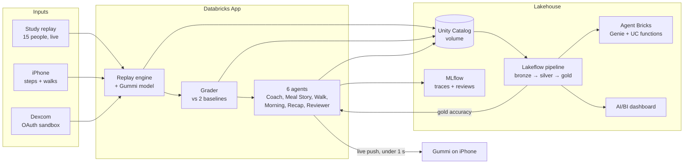

<div align="center">


# Gummi

**A glucose coach that predicts, acts, and checks its own work.**

Overall winner, WolfHacks 2026


</div>


<sub>The live system map. Every box is a real component, and it lights up when that component does work.</sub>

## What it is

If you have prediabetes and wear a glucose monitor, it only shows you what already happened. Apps even get the data an hour late, on purpose. So the questions you actually have, like "can I eat this cookie?" or "should I go for a walk?", don't get a real answer.

Gummi answers them. It's an iPhone app with a jelly koala you chat with, and it does three things:

- **Predicts.** It fills in the missing hour, forecasts the next two, and shows what a food would do before you eat it.
- **Acts.** It nudges you to walk before a spike, writes up how each meal went, and recaps your day without being asked.
- **Checks itself.** Two hours after every prediction, it grades itself against what actually happened, next to two baselines. When it's wrong, you see that too.

Gummi is for adults with prediabetes or type 2 diabetes who don't take insulin. It isn't for treatment decisions.

## How it fits together

None of us wear a Dexcom, so 15 real people from the [BIG IDEAs study](https://physionet.org/content/big-ideas-glycemic-wearable/1.1.3/) stream through the system as a live replay, with the same one-hour delay a real Dexcom has. You follow one of them and live through their day. Real steps come from the phone, and a real Dexcom account connects through Dexcom's sandbox.



## The Databricks side

Databricks isn't just where the data sits. It runs the whole product.

| Piece | What it does for Gummi |
|---|---|
| **Databricks Apps** | Hosts the backend (FastAPI): the replay engine, the model, the agents, and a live push channel to the phone. |
| **Lakeflow Declarative Pipelines** | `gummi_stream` runs continuously. Auto Loader picks up each event about 6 seconds after it lands and builds bronze, silver and gold Delta tables. |
| **Unity Catalog** | Tables, volumes, the registered model, SQL functions and the agent's prompt, all governed in one place. |
| **Foundation Model APIs** | gpt-oss-20b runs chat because it's the fastest, with gpt-oss-120b and Qwen3 as fallbacks. Llama 4 Maverick reviews every answer, so a different model family checks the Coach. |
| **MLflow** | Traces every conversation, tool call by tool call. The Reviewer's scores are attached to each trace as feedback. |
| **Prompt Registry + Jobs** | The Reviewer writes lessons, and a file-arrival Job turns them into a new version of the Coach's prompt. Gummi gets better on its own. |
| **Agent Bricks** | Gummi Insights, a supervisor agent that sends deeper questions to a Genie space or to Unity Catalog functions over the gold tables. |
| **AI/BI and Genie** | A live accuracy dashboard, plus plain-English questions over the streaming data. |

Measured on the live system:

- Phone screens load in **25 to 250 ms**, served from memory.
- Chat's first words arrive in about **1.5 to 2 s**, tool calls included.
- The model predicts in **under 50 ms** on CPU.
- Events reach the bronze table **4 to 8 s** after they land.

## How accurate it is

Average error in mg/dL, lower is better. Every number is out-of-sample: each person is predicted by a model that was trained without them.

| Looking ahead | Gummi | CGM-only (published method) | Last reading |
|---|:-:|:-:|:-:|
| 30 min | **8.9** | 9.5 | 10.7 |
| 1 hour | **12.1** | 13.4 | 14.9 |
| 2 hours | **14.2** | 15.7 | 18.4 |
| 1 hour after a meal | **15.7** | 17.3 | 20.4 |

We reproduced the published CGM-only baseline first (13.90 RMSE at 30 min), then added meals. That's the core idea: meals are what move glucose, and the published model leaves them out.

## Repo

```
gummi/
├── ios/        SwiftUI app, RealityKit jelly koala, live channel, chat
├── backend/    Databricks App: replay, grading, agents, food log, system map, fleet view
├── data/       data load, gummi_model, Lakeflow pipeline, gold tables, Genie, dashboard
└── docs/       API contract (v1.6) and design decisions
```

## Running it

<details>
<summary><b>Data and pipeline</b></summary>

```bash
cd data
python scripts/download_bigideas.py          # the BIG IDEAs files we use, checksum-verified
databricks bundle deploy                     # jobs, the gummi_stream pipeline, tables
databricks bundle run gummi_data_load_train  # load, evaluate, train, save the model to a UC volume
```
Then start `gummi_stream` (continuous for demos, triggered otherwise).
</details>

<details>
<summary><b>Backend (Databricks App)</b></summary>

```bash
cd backend
python3 -m venv .venv && .venv/bin/pip install -r requirements.txt
scripts/deploy.sh                       # syncs and deploys the App (CLI profile "gummi")
.venv/bin/python scripts/smoke.py       # hits every route through the Apps proxy
```
For local tests, run `scripts/fetch_cache.py` once, then `pytest tests/`.
</details>

<details>
<summary><b>iOS</b></summary>

```bash
cd ios
xcodegen generate && open Gummi.xcodeproj
```
Put the App URL and credentials in `Config/Secrets.xcconfig.local` (git-ignored). Without them the app runs on built-in demo data.
</details>

<details>
<summary><b>Demo</b></summary>

```bash
backend/.venv/bin/python backend/scripts/demo_stage.py stage   # sets up the evening of Participant 12's day
backend/.venv/bin/python backend/scripts/demo_stage.py go      # on stage: a meal gets graded about 10 s later
```
</details>

## Team

| | |
|---|---|
| **Pranav Somalraju** | Backend and Databricks platform: the Databricks App, replay engine and grading, all six agents, MLflow tracing and reviews, prompt registry and Jobs, Agent Bricks supervisor, Dexcom integration, deployment |
| **Nikhil Ambavaram** | Data and model: BIG IDEAs ingestion, gummi_model and its evaluation, the Lakeflow pipeline and gold tables, Genie space, dashboard |
| **Mahil Manoharan** | iOS: the SwiftUI app, the RealityKit koala, live updates and chat |

## Credits

Data from the BIG IDEAs Lab Glycemic Variability and Wearable Device Data v1.1.3 on PhysioNet (Bent et al. 2021, npj Digital Medicine). Walking effect from Buffey et al. 2022, Sports Medicine. Dexcom API sandbox.
